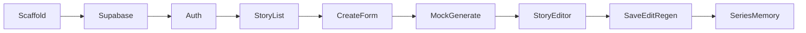

# Phase D: Mock-First Coding Plan

Version: 1.0

Purpose:

First implementation guide for a mock-first build. Planning only — no application code in this phase.

**Superseded in part (2026-06-10):** Stored `illustration_prompt` is a short scene; full copy-ready prompts are assembled on copy. See drift-log entry and [illustration-guide.md](../before-coding/illustration-guide.md) § Story generation assembly.

**Prerequisites:**

* [docs/phase-b-architecture-map.md](../phase-b-architecture-map.md)
* [docs/phase-c-validation-before-coding.md](../phase-c-validation-before-coding.md)

**Authority (highest first):**

1. [product-spec.md](../before-coding/product-spec.md)
2. [source-of-truth.md](../before-coding/source-of-truth.md)
3. [v1-scope.md](../before-coding/v1-scope.md)
4. [character-bible.md](../before-coding/character-bible.md)
5. [illustration-guide.md](../before-coding/illustration-guide.md)
6. [drift-log.md](../before-coding/drift-log.md)
7. [.cursor/rules/](../../.cursor/rules/)

**Stack:** Next.js 14+ App Router + TypeScript + Tailwind CSS + Supabase JS client

**Scope:** Architecture map steps **1–9** only. Phase D ends when the core workflow runs end-to-end on mock generation with real Supabase persistence.

---

## Phase D Success Checklist

- [ ] Teacher can sign in via Supabase Auth (invite-only accounts)
- [ ] Home page lists own `saved` stories only
- [ ] Teacher can enter 4 required + 4 optional inputs and click Generate
- [ ] Mock pipeline returns 12 pages, 12 illustration prompts, vocabulary
- [ ] Draft persists to Supabase and survives refresh
- [ ] Teacher can edit page text and regenerate (mock)
- [ ] Teacher can save story; status becomes `saved`
- [ ] Saved story appears in list and reopens with exact content
- [ ] Series Memory updates on save only — not on generate or regenerate
- [ ] Second story generation reads from updated Series Memory (mock continuity smoke test)

---

# 1. Goal of Phase D

Prove the core teacher workflow end-to-end without a real LLM.

Phase D must demonstrate:

* Real **Supabase Auth**, tables, and RLS
* **Mock generation** returning valid 12-page Nina & Nino stories
* **Save and reopen** across browser sessions
* **Global Series Memory** updating **on save only**

**Success criterion:** A teacher can sign in, generate a mock story, edit a page, regenerate, save, see it in the story list, reopen it, then generate a second story that reads from updated memory.

Phase D does **not** require production-quality story text, real LLM integration, or private URL deployment.

---

# 2. What Mock-First Means

Mock-first means the app runs the full workflow with **fixture data** shaped exactly like real LLM output.

| Real LLM (later) | Mock-first (Phase D) |
|------------------|----------------------|
| API call to OpenAI/Anthropic/etc. | `lib/generation/mock-pipeline.ts` returns deterministic fixtures |
| Prompt engineering in `prompts.ts` | Static character-bible + illustration-guide constants |
| Variable latency | Instant or simulated short delay |
| API keys required | No API keys |

**Mock pipeline rules:**

* Returns data matching the `MockGenerationResult` interface (Section 7)
* Embeds teacher inputs (`theme`, `learning_goal`, `vocabulary_focus`) in placeholder page text
* Reads `series_memory.summary` before generating
* When `recent_stories` is non-empty, page 1 includes a subtle continuity callback in mock text
* Always produces exactly 12 pages, 12 prompts, and 5–7 vocabulary items

**Swap path:** In a later phase, replace internals of `lib/generation/pipeline.ts` with real LLM calls. Routes, DB schema, and UI remain unchanged.

---

# 3. Exact Build Order

Nine steps. Complete in order. Do not skip save or memory steps.



| Step | Build | Maps to phase-b | Done when |
|------|-------|-----------------|-----------|
| **D1** | Next.js scaffold + env vars | Step 1 (partial) | `npm run dev` runs; folder structure exists |
| **D2** | Supabase schema + RLS + seed | Step 1 | Tables exist; `series_memory` singleton seeded |
| **D3** | Auth: `/login`, middleware, sign-out | Step 2 | Unauthenticated users redirect to `/login` |
| **D4** | Story list `/` | Step 3 | Own `saved` stories displayed |
| **D5** | Create form `/stories/new` | Step 4 | 4 required + 4 optional fields with validation |
| **D6** | Mock pipeline + generate API | Step 5 | Generate creates `draft` + pages + vocab; redirects to editor |
| **D7** | Story editor `/stories/[id]` | Step 6 | Pages, prompts with copy, vocabulary displayed |
| **D8** | Save + page edit + regenerate | Steps 7, 11 | Save works; page text persists; regenerate replaces output |
| **D9** | Series Memory load + merge on save | Steps 8, 9 | Memory loads before generate; updates only on save |

**Not in Phase D:** Real LLM (step 10), full error-state polish (step 12), private URL deploy (step 13).

---

# 4. Supabase Setup Steps

## 4.1 Project setup

1. Create a Supabase project at [supabase.com](https://supabase.com)
2. **Disable public sign-up** — Authentication → Providers → Email → disable "Enable sign-ups" (invite-only per drift-log)
3. Manually create 1–2 teacher test accounts via Supabase dashboard (Authentication → Users → Add user)
4. Copy project URL and keys

## 4.2 Environment variables

Create `.env.local` (never commit):

```
NEXT_PUBLIC_SUPABASE_URL=https://your-project.supabase.co
NEXT_PUBLIC_SUPABASE_ANON_KEY=your-anon-key
SUPABASE_SERVICE_ROLE_KEY=your-service-role-key
```

`SUPABASE_SERVICE_ROLE_KEY` is server-only — used for Series Memory merge on save.

## 4.3 Migration file

Create `supabase/migrations/001_initial.sql` with:

### Tables

**`stories`**

```sql
create table stories (
  id uuid primary key default gen_random_uuid(),
  created_by uuid not null references auth.users(id) on delete cascade,
  status text not null check (status in ('draft', 'saved')),
  title text not null,
  theme text not null,
  learning_goal text not null,
  vocabulary_focus text not null,
  main_events text not null,
  setting text,
  tone text,
  words_to_avoid text,
  notes text,
  created_at timestamptz not null default now(),
  updated_at timestamptz not null default now(),
  saved_at timestamptz
);
```

**`story_pages`**

```sql
create table story_pages (
  id uuid primary key default gen_random_uuid(),
  story_id uuid not null references stories(id) on delete cascade,
  page_number int not null check (page_number between 1 and 12),
  text text not null,
  illustration_prompt text not null,
  unique (story_id, page_number)
);
```

**`story_vocabulary`**

```sql
create table story_vocabulary (
  id uuid primary key default gen_random_uuid(),
  story_id uuid not null references stories(id) on delete cascade,
  word text not null,
  definition_or_example text not null,
  sort_order int not null
);
```

**`series_memory`**

```sql
create table series_memory (
  id text primary key,
  summary jsonb not null default '{"characters":[],"settings":[],"recent_stories":[],"vocabulary_history":[],"themes_covered":[],"repetition_notes":[]}'::jsonb,
  updated_at timestamptz not null default now()
);
```

### RLS policies

Enable RLS on all tables.

**`stories`** — teachers own their stories:

```sql
create policy "Users read own stories" on stories for select using (auth.uid() = created_by);
create policy "Users insert own stories" on stories for insert with check (auth.uid() = created_by);
create policy "Users update own stories" on stories for update using (auth.uid() = created_by);
```

**`story_pages`** — via story ownership:

```sql
create policy "Users read own pages" on story_pages for select
  using (exists (select 1 from stories where stories.id = story_pages.story_id and stories.created_by = auth.uid()));
create policy "Users insert own pages" on story_pages for insert
  with check (exists (select 1 from stories where stories.id = story_pages.story_id and stories.created_by = auth.uid()));
create policy "Users update own pages" on story_pages for update
  using (exists (select 1 from stories where stories.id = story_pages.story_id and stories.created_by = auth.uid()));
create policy "Users delete own pages" on story_pages for delete
  using (exists (select 1 from stories where stories.id = story_pages.story_id and stories.created_by = auth.uid()));
```

**`story_vocabulary`** — same pattern as `story_pages`.

**`series_memory`** — all authenticated users can read; writes via service role only (no INSERT/UPDATE policy for anon/authenticated):

```sql
create policy "Authenticated users read series memory" on series_memory for select to authenticated using (true);
```

### Seed

```sql
insert into series_memory (id, summary) values ('nina-nino', '{"characters":[],"settings":[],"recent_stories":[],"vocabulary_history":[],"themes_covered":[],"repetition_notes":[]}'::jsonb)
on conflict (id) do nothing;
```

## 4.4 Apply migration

Run SQL in Supabase SQL Editor or via Supabase CLI (`supabase db push`).

---

# 5. Routes to Build

Frozen per [architecture-freeze.mdc](../../.cursor/rules/architecture-freeze.mdc). No extra routes.

## 5.1 Page routes

| Route | File | Type | Purpose |
|-------|------|------|---------|
| `/login` | `app/login/page.tsx` | Client | Email + password sign-in |
| `/` | `app/page.tsx` | Server | Story list (`saved` only) + New Story link |
| `/stories/new` | `app/stories/new/page.tsx` | Client | Input form + Generate button |
| `/stories/[id]` | `app/stories/[id]/page.tsx` | Server + Client | Story viewer/editor |

## 5.2 API routes

| Method | Endpoint | Purpose |
|--------|----------|---------|
| `POST` | `/api/stories/generate` | Run mock pipeline; insert `draft` story + pages + vocab |
| `POST` | `/api/stories/[id]/save` | Set `status=saved`; trigger Series Memory merge (service role) |
| `POST` | `/api/stories/[id]/regenerate` | Re-run mock pipeline; replace pages + vocab |
| `PATCH` | `/api/stories/[id]/pages` | Update `story_pages.text` for page edits |

## 5.3 Middleware

`middleware.ts` — protect all routes except `/login` and static assets. Redirect unauthenticated users to `/login`.

## 5.4 Story list behavior (locked)

* `/` queries `stories` where `created_by = auth.uid()` AND `status = 'saved'`
* `draft` stories are **not** listed on home
* After generate, redirect to `/stories/[id]`

---

# 6. Components to Build

Minimal set. No global state library.

```
components/
  auth/
    LoginForm.tsx          # email + password, calls supabase.auth.signInWithPassword
    SignOutButton.tsx      # supabase.auth.signOut + redirect /login
  stories/
    StoryList.tsx          # maps saved stories to StoryCard list
    StoryCard.tsx          # title, theme, saved_at; links to /stories/[id]
  create/
    StoryInputForm.tsx     # 4 required + 4 optional fields; submit triggers generate
  story/
    StoryPageList.tsx      # renders 12 pages
    PageEditor.tsx         # inline text edit per page; PATCH on blur
    PromptCopyButton.tsx   # copy illustration_prompt to clipboard
    VocabularyList.tsx     # read-only flashcard list
    SaveButton.tsx         # POST /api/stories/[id]/save
    RegenerateButton.tsx   # POST /api/stories/[id]/regenerate
  ui/
    LoadingSpinner.tsx     # shown during generate/regenerate/save
    ErrorBanner.tsx        # generation/save errors; memory load warning
    Button.tsx             # shared button styles
```

## 6.1 Lib modules

```
lib/
  supabase/
    client.ts              # browser Supabase client (anon key)
    server.ts              # server Supabase client (cookies + service role helper)
  db/
    stories.ts             # CRUD queries for stories, pages, vocabulary
    series-memory.ts       # load singleton, merge on save
  generation/
    pipeline.ts              # exports generateStory() — calls mock in Phase D
    mock-pipeline.ts         # fixture generator
    types.ts                 # MockGenerationResult, StoryInputs, etc.
  series-memory/
    load.ts                  # fetch + format summary for pipeline
    update.ts                # merge saved story into summary (service role)
  constants/
    character-bible.ts       # Tier 1 descriptors from character-bible.md
    illustration-style.ts    # style suffix from illustration-guide.md
```

## 6.2 Project scaffold (D1)

```
app/
  layout.tsx
  page.tsx
  login/page.tsx
  stories/
    new/page.tsx
    [id]/page.tsx
  api/
    stories/
      generate/route.ts
      [id]/
        save/route.ts
        regenerate/route.ts
        pages/route.ts
middleware.ts
```

---

# 7. Mock Generation Output Shape

## 7.1 TypeScript interface

```typescript
// lib/generation/types.ts

export interface StoryInputs {
  theme: string;
  learning_goal: string;
  vocabulary_focus: string;
  main_events: string;
  setting?: string;
  tone?: string;
  words_to_avoid?: string;
  notes?: string;
}

export interface MockGenerationResult {
  story: {
    title: string;           // truncated theme (max 60 chars)
    status: 'draft';
  };
  pages: Array<{
    page_number: number;     // 1–12
    text: string;            // ~30–40 words
    illustration_prompt: string;
  }>;
  vocabulary: Array<{
    word: string;
    definition_or_example: string;
    sort_order: number;      // 1-based
  }>;
}
```

## 7.2 Mock generation rules

| Rule | Detail |
|------|--------|
| Page count | Always exactly 12 |
| Words per page | ~30–40 words of simple ages 4–6 text |
| Characters | Nina (6) and Nino (4) appear; reference [character-bible.md](../before-coding/character-bible.md) |
| Page text | Reference `theme`, `learning_goal`, `main_events`; use `setting` if provided else default from bible |
| Continuity callback | If `memory.summary.recent_stories.length > 0`, page 1 opens with "Nina and Nino remember..." + prior theme |
| Illustration scenes | Short scene stored per page; full production prompt assembled on copy from profiles + scene + style suffix ([illustration-guide.md](../before-coding/illustration-guide.md)) |
| Vocabulary count | 1–40 items (validation); mock pipeline still caps at 7 via `parseVocabularyWords` |
| Title | `theme` truncated to 60 characters |

## 7.3 Illustration prompt template

Applies to **copy-assembled production prompts** (not the stored short scene). Per illustration-guide:

```
[Scene from page]. Nina is a 6-year-old girl, medium-brown skin, dark curly hair in two puffs, yellow shirt, blue overalls, red sneakers. Nino is a 4-year-old boy, medium-brown skin, short curly dark hair, green shirt, tan shorts, blue sneakers. [Setting]. [Mood]. Children's book illustration, warm soft colors, simple shapes, friendly expressions, clean background, ages 4-6, no text in image.
```

## 7.4 Example mock page (page 1, no prior memory)

```
text: "Nina and Nino woke up on a sunny morning. Today they would learn about sharing. Mom smiled and said, 'Let's visit the park!' Nino grabbed his red ball. Nina helped him tie his shoes. They were ready for a new adventure together."
```

## 7.5 Example mock vocabulary item

```
word: "share"
definition_or_example: "Share means to give some of what you have to a friend."
sort_order: 1
```

---

# 8. Save / Reopen Behavior

Locked per drift-log and phase-b-architecture-map.

| Action | DB effect | Series Memory | UI |
|--------|-----------|---------------|-----|
| **Generate** | Insert `stories` (`draft`) + 12 `story_pages` + `story_vocabulary` | No update | Redirect to `/stories/[id]` |
| **Edit page text** | PATCH `story_pages.text` | No update | Inline editor; save on blur |
| **Regenerate** | Update story inputs; delete + reinsert pages + vocab; stays `draft` | No update | Loading state; replace all content |
| **Save** | `status` → `saved`; `saved_at` = now(); `updated_at` = now() | **Merge on save** (server-side) | Redirect to `/` or show success |
| **List `/`** | SELECT `stories` WHERE `created_by` = uid AND `status` = `saved` | N/A | Story cards with title, theme, date |
| **Reopen** | SELECT story + pages + vocab by id | N/A | Full editor view |

**Draft persistence:** Draft written to Supabase on generate. Survives page refresh.

**Drafts not in list:** Home page shows `saved` only. Teacher reaches drafts via post-generate redirect.

**Illustration scenes:** Show/hide in UI; copy assembles full production prompt. Regenerate for new scene after page text edit.

**Vocabulary:** Read-only. Regenerate to change.

**No delete:** Story deletion excluded from V1.

---

# 9. Series Memory Mock Behavior

## 9.1 Load (before generate)

1. `POST /api/stories/generate` calls `lib/series-memory/load.ts`
2. Fetch `series_memory` where `id = 'nina-nino'`
3. Pass `summary` JSON to `mock-pipeline.ts`
4. **On failure:** proceed with empty summary; return non-blocking warning in API response; UI shows `ErrorBanner`

## 9.2 Update (on save only)

Triggered by `POST /api/stories/[id]/save` using **service role** client.

**Merge steps (no LLM — simple extraction):**

1. Read current `series_memory.summary`
2. Build story summary object:
   ```json
   {
     "title": "...",
     "theme": "...",
     "key_events": "first 200 chars of main_events",
     "vocab": ["word1", "word2"],
     "characters": ["Nina", "Nino"]
   }
   ```
3. Append to `recent_stories`; cap at 15 (remove oldest)
4. Append `theme` to `themes_covered` (dedupe)
5. Merge vocabulary words into `vocabulary_history` (dedupe)
6. If `setting` provided, append to `settings` if new
7. Set `updated_at` = now()
8. Write back via service role

**Does NOT run on:** generate, regenerate, draft, delete.

## 9.3 Mock continuity smoke test

After first save, generate a second story. Mock pipeline checks `recent_stories.length > 0` and adds callback text on page 1. This validates the load path without a real LLM.

## 9.4 series_memory.summary shape

```json
{
  "characters": [],
  "settings": ["Neighborhood Park"],
  "recent_stories": [
    {
      "title": "A Day at the Park",
      "theme": "sharing",
      "key_events": "Nina and Nino learn to share a ball...",
      "vocab": ["share", "ball", "friend"],
      "characters": ["Nina", "Nino"]
    }
  ],
  "vocabulary_history": ["share", "ball", "friend"],
  "themes_covered": ["sharing"],
  "repetition_notes": []
}
```

---

# 10. First Coding Prompt

Copy-paste this into Cursor to start implementation.

## Prompt D1–D2: Scaffold + Supabase

```
Implement Phase D steps D1 and D2 only for StoryGen V2.

Read first:
- docs/archive/phase-d-mock-first-coding-plan.md
- docs/phase-b-architecture-map.md
- .cursor/rules/

Tasks:
1. Scaffold Next.js 14 App Router + TypeScript + Tailwind in this repo.
2. Add @supabase/supabase-js and @supabase/ssr.
3. Create lib/supabase/client.ts and lib/supabase/server.ts.
4. Create supabase/migrations/001_initial.sql exactly as specified in docs/archive/phase-d-mock-first-coding-plan.md Section 4.
5. Add .env.local.example with required env vars (no real keys).
6. Create placeholder app/layout.tsx and app/page.tsx (minimal).

Do NOT build auth, API routes, or story UI yet.
Do NOT add real LLM, image generation, or export.
Follow architecture-freeze.mdc — 4 page routes only, 5 tables only.
```

## Prompt D3: Auth

```
Implement Phase D step D3 only.

Add:
- app/login/page.tsx with LoginForm
- middleware.ts protecting all routes except /login
- SignOutButton component
- Redirect authenticated users away from /login to /

Use Supabase Auth email + password. Invite-only — no sign-up UI.
Follow docs/archive/phase-d-mock-first-coding-plan.md.
```

## Prompt D4–D5: List + Create Form

```
Implement Phase D steps D4 and D5 only.

D4: app/page.tsx — server component fetching own saved stories (status=saved).
    StoryList + StoryCard components.

D5: app/stories/new/page.tsx — StoryInputForm with 4 required + 4 optional fields.
    Client-side validation before Generate button enables.

Do not wire generate API yet.
```

## Prompt D6–D9: Mock Pipeline + Full Workflow

```
Implement Phase D steps D6 through D9.

D6: lib/generation/mock-pipeline.ts + pipeline.ts + types.ts
    POST /api/stories/generate — load memory, run mock, insert draft, return story id

D7: app/stories/[id]/page.tsx — StoryPageList, PromptCopyButton, VocabularyList

D8: PageEditor (PATCH pages), SaveButton, RegenerateButton
    POST save, POST regenerate, PATCH pages API routes

D9: lib/series-memory/load.ts + update.ts
    Memory merge on save via service role in save route

Follow mock output shape in phase-d Section 7.
Series Memory updates on save only.
```

---

# 11. What NOT to Build Yet

Explicit exclusions for Phase D and beyond.

| Exclude | Reason |
|---------|--------|
| Real LLM / API keys | Phase D is mock-first; phase-b step 10 |
| `lib/generation/prompts.ts` LLM calls | Defer to post-Phase D |
| In-app image generation | Locked V1 exclusion |
| Image storage in Supabase | Locked V1 exclusion |
| Export (PDF, print, download) | v1-scope exclusion |
| Student accounts | Locked exclusion |
| Story deletion UI | drift-log + v1-scope exclusion |
| Public sign-up UI | Invite-only per drift-log |
| Settings page | No route in frozen architecture |
| Analytics, payments, marketplace | v1-scope exclusions |
| Mobile-first polish | v1-scope exclusion |
| Private URL production deploy | phase-b step 13 |
| localStorage as primary persistence | Locked exclusion |
| Extra routes beyond 4 page + 4 API | architecture-freeze |
| Extra Supabase tables | architecture-freeze |
| Rich text editor, page reorder | Complex editing exclusion |
| Multiple series | Locked single series |

---

# Appendix A: Error Behavior (Phase D minimum)

Implement basic error handling during D6–D9. Full polish is phase-b step 12.

| Failure | Behavior |
|---------|----------|
| Generation fails | `ErrorBanner` + retry; no memory update; no partial story |
| Memory load fails | Proceed with empty memory; non-blocking warning |
| Save fails | `ErrorBanner`; stay on editor; draft preserved |
| Auth fails | Show error on login form |

---

# Appendix B: File Creation Checklist

Files to create during Phase D implementation (reference only — not created in this doc phase):

| Path | Step |
|------|------|
| `package.json` | D1 |
| `supabase/migrations/001_initial.sql` | D2 |
| `middleware.ts` | D3 |
| `app/login/page.tsx` | D3 |
| `app/page.tsx` | D4 |
| `app/stories/new/page.tsx` | D5 |
| `app/stories/[id]/page.tsx` | D7 |
| `app/api/stories/generate/route.ts` | D6 |
| `app/api/stories/[id]/save/route.ts` | D8 |
| `app/api/stories/[id]/regenerate/route.ts` | D8 |
| `app/api/stories/[id]/pages/route.ts` | D8 |
| `lib/generation/mock-pipeline.ts` | D6 |
| `lib/series-memory/update.ts` | D9 |

---

*End of Phase D plan. No application code created in this document.*
