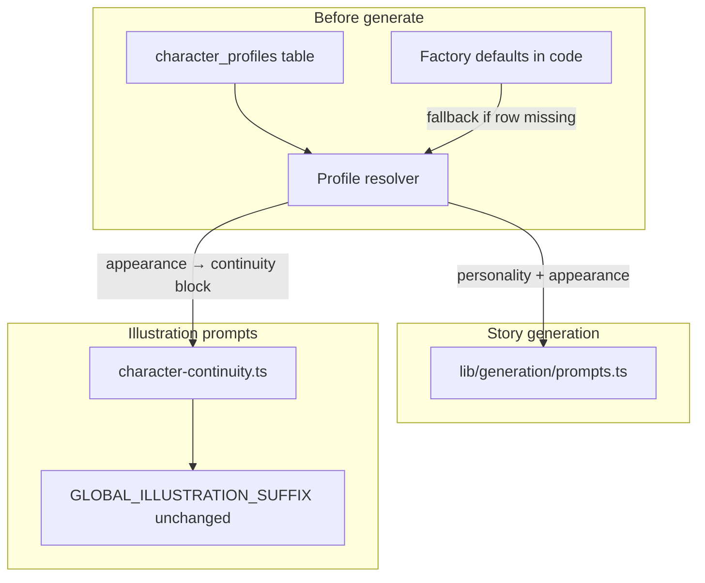

# Editable Characters — Phase 1 Implementation Plan

Version: 1.0

Status: Planning — approved for implementation; code not started

**Authority:**

* [docs/character-editing-decision-record.md](character-editing-decision-record.md) — product direction
* [docs/before-coding/drift-log.md](before-coding/drift-log.md) — Accepted 2026-06-09
* [docs/phase-b-architecture-map.md](phase-b-architecture-map.md) §11 — future architecture
* [.cursor/rules/architecture-freeze.mdc](../.cursor/rules/architecture-freeze.mdc) — approved post-V1 exception
* [docs/roadmap-todo.md](roadmap-todo.md) — tactical queue

**Note:** Authority docs and drift-log supersede the decision-record header if it still reads "Not Ready For Implementation."

This document eliminates ambiguity before Phase 1 code begins. It does **not** approve shipping by itself — it is the implementation blueprint.

---

# 1. Purpose

## Why Editable Characters exists

Official character definitions (Nina, Nino, Mom, Dad, Grandpa, Ms. Lee) are **hardcoded** today in:

* [`lib/generation/character-continuity.ts`](../lib/generation/character-continuity.ts) — illustration `LOCKED CHARACTER CONTINUITY` blocks
* [`lib/constants/character-bible.ts`](../lib/constants/character-bible.ts) — story-generation excerpt and Tier 1 rules

Any appearance or personality change currently requires a code or Cursor edit. That slows iteration for a personal teacher tool and conflicts with the post-V1 goal of in-app character setup.

## Problem it solves

Teachers need a **simple in-app path** to adjust official character appearance and personality descriptions. Future story generation and illustration prompts should reflect those edits **without** redeploying code.

## Phase 1 includes

* **Global shared** editable default profiles for the six official characters (one profile set for the whole app — same sharing model as `series_memory`)
* **Save** appearance and personality edits
* **Reset** one character, reset all characters, restore factory defaults from Character Bible
* **Generation usage** — saved profiles used in story AI prompts and illustration continuity blocks
* **Lightweight UI** — Edit Characters button + modal on existing authenticated surfaces (no new page route)

## Phase 1 intentionally excludes

* Series-scoped profiles
* Story-specific character overrides (Phase 2)
* Teacher-created / story-introduced character persistence (Phase 3)
* Character presets, multiple series, relationship editor
* Per-teacher profile sets
* In-app image generation
* New page routes (e.g. `/characters`, `/settings`)
* Retroactive rewrite of existing saved stories

---

# 2. User Workflow

Keep the workflow minimal. Do not add settings systems or profile managers.

```
Teacher signs in
        ↓
Lands on /stories (story list)
        ↓
Clicks "Edit Characters" (header, beside New Story)
        ↓
Modal opens — list of six official characters:
  Nina · Nino · Mom · Dad · Grandpa · Ms. Lee
        ↓
Teacher selects one character
        ↓
Edits appearance and personality text fields
        ↓
Clicks Save (persists global profile)
        ↓
Optional: "Reset this character" or "Reset all characters" (confirm)
        ↓
Closes modal
        ↓
Teacher creates or opens a story as today (New Story → Generate, etc.)
        ↓
Next Generate or Regenerate uses updated global profiles
        ↓
Existing saved story pages are unchanged unless teacher regenerates
```

**Clicks to edit one character:** open modal (1) → select character (2) → save (3).

**UX copy in modal:** "Changes affect future stories only. Existing saved stories are not rewritten."

**No extra workflows:** no character creation wizard, no story-level override panel, no import/export.

---

# 3. Editable Fields

Phase 1 uses **two editable text fields per character**. Nothing else.

## Editable in Phase 1

| Field | Purpose | Example (Nina) | Why Phase 1 |
|-------|---------|----------------|-------------|
| `appearance_description` | Visual continuity for story text and illustration `LOCKED CHARACTER CONTINUITY` blocks | ~6 years old, medium skin tone, dark brown pigtails, bright red t-shirt, dark red shorts, white socks, red sneakers, brown eyes, warm friendly smile | Core user need — adjust how characters look in generated stories and prompts |
| `personality_description` | Voice and behavior for story-generation AI context | Curious, patient, encouraging; short clear sentences; praises Nino's efforts | Supports story voice without a separate "voice editor" system |

## Not editable in Phase 1

| Item | Reason deferred |
|------|-----------------|
| Character id / key (`nina`, `nino`, …) | Stable system identifier |
| Display name (Nina, Nino, …) | Official roster is fixed in Phase 1 |
| Age, role, tier | Stay in Character Bible; avoid form sprawl |
| Relationships (siblings, family graph) | Relationship editor is out of scope |
| DO NOT rules as separate fields | Applied via code template when building illustration blocks — not teacher-edited |
| Reference images / avatars | In-app image generation excluded |
| Character presets / duplicate profiles | Presets excluded |
| Story-specific overrides | Phase 2 |
| Tier 2 characters (Sam, Biscuit) | Official roster only |

## Simplicity rule

Store **plain text** in the database. At generation time:

* **Story prompt** — inject `personality_description` + `appearance_description` per official character into dynamic Tier 1 rules
* **Illustration prompt** — assemble `LOCKED CHARACTER CONTINUITY` block from `appearance_description` wrapped in the existing template (role line + DO NOT list from code), rather than storing the full multi-line continuity template in the DB

---

# 4. Reset Behavior

Factory defaults come from [docs/before-coding/character-bible.md](before-coding/character-bible.md) (§3 appearances, personality/voice per character, §14 quick reference). Migration seed values should match existing code constants in `character-continuity.ts` and `character-bible.ts`.

## Reset one character

**What happens:**

1. Teacher selects a character in the modal and clicks **Reset this character**
2. Optional light confirm: "Restore Nina to factory defaults?"
3. Server overwrites that row's `appearance_description` and `personality_description` with factory values for that `character_id`
4. `updated_at` refreshes
5. UI shows restored text immediately

**Effect:** Future generations use factory text for that character only. Other characters' saved edits are untouched. Existing saved stories are not rewritten.

## Reset all characters

**What happens:**

1. Teacher clicks **Reset all characters**
2. **Required** confirm dialog: "Restore all six characters to factory defaults? This cannot be undone."
3. Server overwrites all six rows with factory defaults
4. Modal refreshes with factory text for every character

**Effect:** Global profile set returns to Character Bible factory state. Future generations use factory defaults for all official characters.

## Factory defaults (source of truth)

| Layer | Role |
|-------|------|
| **Character Bible (markdown)** | Product authority for factory appearance and personality |
| **Code constants** | Implementation seed source (`CHARACTER_CONTINUITY`, `CHARACTER_BIBLE_EXCERPT`) — must stay aligned with bible at seed/reset time |
| **Database rows** | Live editable copy; reset restores from factory map, not from "last saved story" |

Factory defaults are **not** deleted from code when profiles ship. Code remains the fallback if a DB row is missing and the canonical source for seed migrations.

---

# 5. Generation Behavior

## Precedence rule

**If a `character_profiles` row exists for an official character → use saved `appearance_description` / `personality_description`.**

**If missing → fall back to factory defaults from code constants (aligned with Character Bible).**

Saved profile always wins over hardcoded defaults when present.

## Current vs future

| Stage | Current (V1) | Future (Phase 1) |
|-------|--------------|------------------|
| **Load** | No DB read; static imports | Load all global `character_profiles` rows before generate/regenerate |
| **Story AI system prompt** | `CHARACTER_BIBLE_EXCERPT` + `TIER1_CHARACTER_RULES` from [`lib/constants/character-bible.ts`](../lib/constants/character-bible.ts) via [`lib/generation/prompts.ts`](../lib/generation/prompts.ts) | Dynamic per-character lines from saved profiles; static bible excerpt for series tone/structure only (setting, tone guardrails, page pattern) |
| **Illustration continuity** | `CHARACTER_CONTINUITY[id]` verbatim from [`lib/generation/character-continuity.ts`](../lib/generation/character-continuity.ts) via `getCharacterContinuityText` / `buildIllustrationPrompt` | Continuity block built from saved `appearance_description` for each detected official character on the page |
| **STYLE suffix** | `GLOBAL_ILLUSTRATION_SUFFIX` — unchanged | Unchanged |
| **Post-process** | `injectIllustrationContinuityIntoPages` | Same pipeline; resolver feeds continuity text |
| **Copy / resolve-production-prompt** | Uses continuity helpers today | Same resolver path for consistency |

## Flow diagram



## Stories already saved

* **No automatic rewrite** when profiles change
* **Regenerate** on a story uses **current** global profiles at regen time (same as today regen replaces content from current inputs)
* **Reopen** shows stored page text and prompts as saved — unchanged until regen

---

# 6. Data Model Proposal

Planning only. No SQL. No migrations in this document.

## Table: `character_profiles`

Global singleton — **six rows** after seed (one per official character). Shared across all authenticated teachers (like `series_memory`).

| Concept | Store? | Notes |
|---------|--------|-------|
| `character_id` | Yes | Primary key / unique: `nina`, `nino`, `mom`, `dad`, `grandpa`, `ms_lee` |
| `display_name` | Yes | Read-only in UI: Nina, Nino, Mom, Dad, Grandpa, Ms. Lee |
| `appearance_description` | Yes | Editable text; feeds illustration continuity + story appearance context |
| `personality_description` | Yes | Editable text; feeds story generation voice/behavior |
| `updated_at` | Yes | Audit timestamp |
| Factory DO NOT rules | No | Remain in code template when assembling illustration blocks |
| `series_id` | No | Deferred — single series only |
| `created_by` / per-teacher scope | No | Global shared in Phase 1 |
| `story_id` / overrides | No | Phase 2 |
| Images, presets, JSON blobs | No | Out of scope |

## What stays in Character Bible

* Series overview and tone guardrails
* Tier definitions (Tier 1 / 2 / 3)
* Age guardrails and classroom-safety rules
* Factory default narrative for each official character (authority for reset)
* Illustration guide cross-references and suffix rules
* Future Phase 2/3 scope notes

## RLS (decide at implementation)

* Authenticated teachers: `SELECT` + `UPDATE` on all rows (global shared edit rights for pilot group)
* Seed migration: service role (mirror `series_memory` seed pattern)
* No per-row teacher ownership in Phase 1

---

# 7. UI Proposal

## Placement

**Primary (required for MVP):** [`app/stories/page.tsx`](../app/stories/page.tsx) header — **Edit Characters** button beside **New Story** and **Sign out**.

**Optional (not required for MVP):** same button on [`app/stories/[id]/page.tsx`](../app/stories/[id]/page.tsx) story editor header for convenience when reviewing a story.

**No new routes.** Modal only — complies with architecture-freeze exception.

## Interaction

1. **Edit Characters** opens a modal (client component)
2. Left or top: list of six characters (display names)
3. Right or below: two textareas — Appearance, Personality
4. Actions: **Save** · **Reset this character** · **Reset all** · **Close**
5. Inline note: "Affects future stories only."

## What to avoid

* Dedicated settings page or `/characters` route
* Tabbed profile manager with avatars
* Relationship graph editor
* Separate appearance vs illustration field split (one appearance field is enough)
* Multi-step wizard

## Click budget

Aligned with product goal ("minimal clicks"): three clicks from story list to save one character edit (open → select → save).

---

# 8. Explicit Non-Goals

Phase 1 does **not** include:

* Series-scoped character profiles
* Story-specific character overrides (beach hat, rain boots, etc.)
* Character presets or duplicate profile templates
* Teacher-created or story-introduced character editing / persistence
* Character relationships editor
* Multiple universes or multiple series
* Character marketplace or sharing
* In-app image generation or reference-image upload
* New page routes (`/characters`, `/settings`, etc.)
* Per-teacher profile isolation
* Retroactive update of existing saved story pages when profiles change
* Editing Tier 2 characters (Sam, Biscuit)
* Editing vocabulary, Series Memory, or story setup from the character modal
* Public sign-up or student-facing character UI

If a request maps to this list → defer to Phase 2, Phase 3, or Bucket 3 in [docs/product-roadmap.md](product-roadmap.md).

---

# 9. Risks

| Risk | Description | Mitigation |
|------|-------------|------------|
| **Overengineering** | Extra fields, routes, per-teacher scoping, or full continuity templates in DB | Two text fields; one table; modal on `/stories`; single resolver module |
| **Continuity drift** | Edited appearance breaks illustration suffix contract or omits DO NOT rules | Keep `GLOBAL_ILLUSTRATION_SUFFIX` locked; assemble continuity from appearance + code template; run existing copy/regen validation |
| **User confusion** | Teacher expects old stories to update when profiles change | Modal copy: "future stories only"; no silent rewrite |
| **Global edit blast radius** | One teacher's edit affects all teachers' next generations | Intentional for pilot (matches `series_memory`); document in UI; acceptable for trusted small group |
| **Pipeline fork** | Story and illustration paths read different sources | One `lib/character-profiles/` resolver consumed by `prompts.ts` and `character-continuity.ts` |
| **Factory / DB drift** | Seed values diverge from Character Bible after edits | Reset always restores from factory map sourced from bible-aligned constants; bible remains authority |
| **Scope creep at implementation** | "Just add story override while we're here" | This plan + non-goals list; checklist in [docs/roadmap-todo.md](roadmap-todo.md) |

---

# 10. Implementation Recommendation

Build in small vertical slices. Match [docs/roadmap-todo.md](roadmap-todo.md) implementation candidates.

| Step | Work | Validates |
|------|------|-----------|
| **1** | Migration `004_character_profiles.sql` — table + seed six factory rows | Persistence + seed |
| **2** | `lib/character-profiles/` — `loadProfiles`, `getFactoryDefaults`, `resolveAppearance`, `resolvePersonality`, `buildContinuityBlock` | Resolver + fallback |
| **3** | API: `GET /api/character-profiles`, `PATCH /api/character-profiles/[id]`, `POST /api/character-profiles/reset` (one + all) — no page routes | Save + reset without UI |
| **4** | Wire resolver into [`lib/generation/prompts.ts`](../lib/generation/prompts.ts) — dynamic Tier 1 rules from profiles | Story generation uses DB |
| **5** | Wire resolver into [`lib/generation/character-continuity.ts`](../lib/generation/character-continuity.ts) — `getCharacterContinuityText` uses saved appearance | Illustration prompts use DB |
| **6** | `EditCharactersModal` + **Edit Characters** button on `/stories` | Teacher edit path |
| **7** | Reset one + reset all in modal (with confirm on reset all) | Factory restore |
| **8** | Manual validation: edit Nina appearance → generate story → inspect page text + illustration prompt; reset Nina → regen → factory restored | End-to-end |

**After ship (documentation):**

* drift-log entry → Status: Implemented
* [docs/project-changelog.md](project-changelog.md) entry
* Check off implementation candidates in [docs/roadmap-todo.md](roadmap-todo.md)

**Do not start step 1 until this plan is reviewed.** Steps 4–5 should not ship before step 2 resolver exists.

---

# Appendix A — Open Questions

Resolve during implementation (defaults recommended):

| Question | Recommendation |
|----------|----------------|
| Edit Characters on story editor page in MVP? | **Optional** — `/stories` only for MVP; add `/stories/[id]` button only if pilot asks |
| Exact API route naming? | `GET/PATCH /api/character-profiles`, `POST /api/character-profiles/reset` with body `{ character_id? }` — omit `character_id` for reset all |
| Does `CHARACTER_BIBLE_EXCERPT` stay static? | **Yes** — series tone, structure, safety; only per-character Tier 1 lines become dynamic |
| RLS: any teacher can update global rows? | **Yes** for pilot — mirror trusted-group model; revisit if multi-tenant later |
| Confirm on reset one character? | Optional; **required** on reset all |
| Max length for text fields? | Reasonable cap (e.g. 2000 chars) to prevent prompt blow-up — enforce server-side |

---

# Appendix B — Code Touchpoints (reference)

| File | Phase 1 change |
|------|----------------|
| [`lib/generation/character-continuity.ts`](../lib/generation/character-continuity.ts) | Resolver input for continuity blocks |
| [`lib/constants/character-bible.ts`](../lib/constants/character-bible.ts) | Factory defaults export for seed/reset; dynamic rules replace static `TIER1_CHARACTER_RULES` at runtime |
| [`lib/generation/prompts.ts`](../lib/generation/prompts.ts) | Accept resolved profile context in `buildSystemPrompt` |
| [`lib/generation/ai-generation.ts`](../lib/generation/ai-generation.ts) | Load profiles once per generate/regenerate call |
| [`app/stories/page.tsx`](../app/stories/page.tsx) | Edit Characters button |
| New: `components/characters/EditCharactersModal.tsx` | Modal UI |
| New: `lib/character-profiles/*` | Load, resolve, factory defaults |
| New: `app/api/character-profiles/*` | CRUD + reset |

---

# Appendix C — Readiness

| Check | Status |
|-------|--------|
| Decision record written | Yes |
| Drift-log Accepted entry | Yes |
| Authority docs updated (source-of-truth, bible, illustration-guide, phase-b §11, architecture-freeze) | Yes |
| Roadmap-todo documentation prerequisites | Complete |
| Implementation plan (this document) | Yes — after review |
| Code / schema started | No |

**Phase 1 appears ready for implementation** after a quick review of this plan. No authority conflicts identified — post-V1 sections explicitly preserve V1 baseline until Phase 1 ships.

**Scope creep watchlist:** storing full continuity templates in DB; per-teacher rows; story-editor override UI; `/characters` route; Tier 2 editing; merging Phase 2 into Phase 1 "while we're here."
