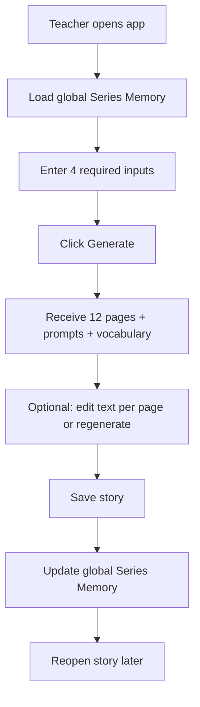
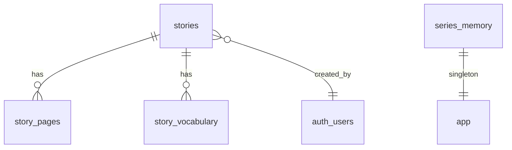
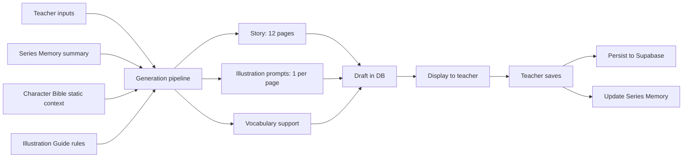

# Phase B: Architecture Map

Version: 1.0

Purpose:

This document maps the V1 product specifications into a simple, understandable architecture.

Planning only. No production code.

**Source of truth (authority order):**

1. [product-spec.md](../product-spec.md)
2. [source-of-truth.md](../source-of-truth.md)
3. [v1-scope.md](../v1-scope.md)
4. [character-bible.md](../character-bible.md)
5. [illustration-guide.md](../illustration-guide.md)
6. [drift-log.md](../drift-log.md)

**Architecture decisions incorporated (Phase B):**

* Supabase Auth — individual teacher accounts (no student accounts)
* Global shared Series Memory — all teachers contribute to the same Nina & Nino continuity
* Framework-agnostic frontend structure — specs do not mandate a tech stack

**Spec conflict resolved:**

[product-spec.md](../product-spec.md) states "Generated story updates Series Memory." [source-of-truth.md](../source-of-truth.md) locked rule wins: **Series Memory updates on save only** — not on draft, not on failed generation, not on delete.

---

# 1. Product Summary

StoryGen V2 is a teacher-first web application that helps kindergarten, preschool, ESL/EFL, and early literacy teachers create usable educational stories quickly.

V1 delivers:

* **Nina & Nino** stories for ages 4–6, English only
* **12 story pages** per story (~30–40 words per page)
* **Illustration prompts** (one per page) — copy-ready for external image tools; no in-app image generation
* **Vocabulary support** / flashcards aligned to the teacher's vocabulary focus
* **Global Series Memory** persisted in Supabase — maintains continuity and reduces repetition across all saved stories
* **Supabase Auth** for individual teacher accounts
* **Private hosted URL** for validation with a small trusted teacher group — not a public launch

Primary goal: help teachers reach a usable first draft with minimal interaction time. Generation should feel fast; the under-2-minute figure is a soft guiding target, not a hard SLA.

V1 exists to validate the core workflow, not to scale or future-proof.

---

# 2. Core V1 Workflow

This workflow must work end-to-end. If any step fails, V1 fails.

1. Teacher opens the app (authenticated via Supabase Auth)
2. System loads global Nina & Nino Series Memory
3. Teacher enters minimal inputs (4 required, optional fields as needed)
4. Teacher clicks Generate
5. Teacher receives:
   * 12 story pages
   * 12 illustration prompts (one per page)
   * Vocabulary support / flashcards
6. Teacher optionally edits text per page and/or regenerates from edited inputs
7. Teacher saves the story
8. Saved story updates global Series Memory
9. Teacher reopens the story later

**Important:** Generation creates a draft. Series Memory does **not** update until the teacher saves.



---

# 3. Proposed App Routes

Keep routes minimal. Only what V1 requires.

| Route | Purpose |
|-------|---------|
| `/login` | Supabase Auth sign-in for teachers |
| `/` | Story list (teacher's own saved stories) + "New Story" action |
| `/stories/new` | Input form (4 required + optional fields) + Generate |
| `/stories/[id]` | Story viewer/editor: 12 pages, illustration prompts with copy button, vocabulary, Save, Regenerate |

**Auth behavior:**

* Unauthenticated users redirect to `/login`
* Auth onboarding: invite-only — admin provisions teacher accounts; public sign-up disabled in Supabase
* No routes for settings, export, student mode, image preview, or marketplace features

**Story list behavior (locked):**

* `/` lists teacher's own `saved` stories only
* `draft` stories are not shown on the home list
* After generate, teacher is redirected to `/stories/[id]` to access the draft

---

# 4. Proposed Data Model

Supabase tables for V1. Five tables — no over-engineering.

Tier 1 character definitions (Nina, Nino, Mom, Dad) come from static [character-bible.md](../character-bible.md) at generation time. They are not duplicated in the database for V1.

## `stories`

Story metadata and teacher inputs.

| Column | Type | Notes |
|--------|------|-------|
| `id` | uuid | Primary key |
| `created_by` | uuid | FK to `auth.users` |
| `status` | text | `draft` or `saved` |
| `title` | text | Short label (derived from theme or generated) |
| `theme` | text | Required input |
| `learning_goal` | text | Required input |
| `vocabulary_focus` | text | Required input |
| `main_events` | text | Required input |
| `setting` | text | Optional, nullable |
| `tone` | text | Optional, nullable |
| `words_to_avoid` | text | Optional, nullable |
| `notes` | text | Optional, nullable |
| `created_at` | timestamptz | |
| `updated_at` | timestamptz | |
| `saved_at` | timestamptz | Nullable; set when status becomes `saved` |

## `story_pages`

One row per page. Exactly 12 pages per story.

| Column | Type | Notes |
|--------|------|-------|
| `id` | uuid | Primary key |
| `story_id` | uuid | FK to `stories` |
| `page_number` | int | 1–12 |
| `text` | text | ~30–40 words |
| `illustration_prompt` | text | Copy-ready prompt per [illustration-guide.md](../illustration-guide.md) |

Unique constraint on `(story_id, page_number)`.

## `story_vocabulary`

Vocabulary support / flashcards per story.

| Column | Type | Notes |
|--------|------|-------|
| `id` | uuid | Primary key |
| `story_id` | uuid | FK to `stories` |
| `word` | text | Target vocabulary word |
| `definition_or_example` | text | Child-friendly definition or example sentence |
| `sort_order` | int | Display order |

## `series_memory`

Singleton table — one row for global Nina & Nino shared memory.

| Column | Type | Notes |
|--------|------|-------|
| `id` | text | Fixed constant (e.g. `nina-nino`) |
| `summary` | jsonb | Compressed continuity data (see below) |
| `updated_at` | timestamptz | Last save-triggered update |

**`summary` JSONB structure:**

```json
{
  "characters": [],
  "settings": [],
  "recent_stories": [],
  "vocabulary_history": [],
  "themes_covered": [],
  "repetition_notes": []
}
```

* `characters` — Tier 2/3 promotions, story-specific traits, appearance changes noted in saved stories
* `settings` — recurring locations used across stories
* `recent_stories` — compressed summaries (title, theme, key events, vocab taught, characters appeared); capped at 10–15 entries
* `vocabulary_history` — words taught across saved stories
* `themes_covered` — recent themes for repetition avoidance
* `repetition_notes` — brief patterns to vary in future generation

Compressed story summaries live inside `series_memory.summary.recent_stories`. No separate `story_memory_summaries` table for V1.

## Entity relationships



## Row Level Security (intent)

* Teachers read and write their own `stories`, `story_pages`, and `story_vocabulary`
* All authenticated teachers can read `series_memory`
* `series_memory` updates happen server-side on save only — not from the client directly

---

# 5. Series Memory Plan

## What memory stores

Per [source-of-truth.md](../source-of-truth.md), Series Memory tracks:

* Characters (Tier 2/3 promotions, appearance changes from saved stories)
* Character appearance rules and relationships observed in stories
* Compressed story history (not full page text)
* Themes and settings used
* Key events from saved stories
* Vocabulary history
* Repetition patterns

Tier 1 characters (Nina, Nino, Mom, Dad) are always injected from [character-bible.md](../character-bible.md) at generation time.

## When memory updates

| Event | Updates memory? |
|-------|-----------------|
| Story saved (`status` → `saved`) | Yes |
| Draft exists | No |
| Generation fails | No |
| Story deleted | No |
| Regenerate (before save) | No |

## What loads during generation

1. Global `series_memory.summary` (compressed JSON)
2. Static character bible excerpt (Tier 1 always; relevant Tier 2 from memory)
3. Illustration guide rules (style suffix, prompt format)
4. Teacher inputs (required + optional) — **these override continuity**

Priority order per spec:

1. Core continuity entities
2. Recent story history
3. Relevant story history
4. Compressed older history

## How to avoid loading every full story

* Never load all `story_pages` text for all stories into the generation prompt
* Use `recent_stories` summaries only: title, theme, 2–3 sentence plot, vocabulary used, characters that appeared
* Cap `recent_stories` at 10–15 entries; roll off or further compress oldest entries
* Tier 1 character definitions are static — no DB fetch needed

## Teacher instructions override continuity

Teacher inputs take precedence over memory hints:

* `theme`, `learning_goal`, `vocabulary_focus`, `main_events` define the current story
* `notes`, `words_to_avoid`, `setting`, `tone` can explicitly override continuity suggestions

Continuity guides generation. Continuity does not block generation.

## On save — memory merge (server-side)

When a story is saved:

1. Generate a short summary from the saved story (plot, theme, vocab, characters, setting)
2. Append to `recent_stories` (enforce cap)
3. Update `vocabulary_history` with words from this story
4. Update `themes_covered`
5. Update `characters` and `settings` if new Tier 2/3 entities or locations appeared
6. Update `repetition_notes` if useful for future variation
7. Set `updated_at`

All teachers share this single global memory row.

---

# 6. Generation Pipeline



## Inputs

**Required** (from [v1-scope.md](../v1-scope.md)):

* Theme / Topic
* Learning Goal
* Vocabulary Focus
* Main Events

**Optional:**

* Setting
* Tone
* Words to avoid
* Notes

## Context assembled for generation

| Source | What it provides |
|--------|------------------|
| Teacher inputs | Story direction; overrides continuity |
| Series Memory | Compressed history, vocab taught, themes, characters, repetition notes |
| Character Bible | Tier 1 characters, voice rules, age guardrails, educational tone |
| Illustration Guide | Prompt template, style suffix, character consistency rules |

## Outputs

| Output | Spec |
|--------|------|
| Story pages | 12 pages, ~30–40 words each, ages 4–6 readability |
| Illustration prompts | 1 per page; copy-ready; follows illustration-guide template + style suffix |
| Vocabulary support | Words from vocabulary focus + context; child-friendly definitions or examples |

## Save behavior

* Generation writes a `draft` story with pages and vocabulary to Supabase
* Teacher reviews and optionally edits page text
* Save transitions `status` to `saved`, sets `saved_at`, triggers Series Memory merge
* Series Memory does not update until save

## Regenerate behavior

* Teacher edits inputs and/or page text, then clicks Regenerate
* Pipeline re-runs with updated inputs + current Series Memory
* Replaces draft pages, prompts, and vocabulary
* Does not update Series Memory until the teacher saves again

## Draft behavior (locked)

* Successful generate writes a `draft` story to Supabase immediately
* Draft survives page refresh
* Story title auto-generated from theme (truncated short label)
* Illustration prompts: read-only + copy button; regenerate for new prompts
* Vocabulary items: read-only; regenerate to change

## Error behavior (locked)

| Failure | Behavior |
|---------|----------|
| Generation fails | Show error message + retry; no Series Memory update; do not save partial story |
| Series Memory load fails | Proceed with empty memory + static character bible; show non-blocking warning |
| Save fails | Show error; remain on editor; draft data preserved; memory not updated |

## V1 shortcut

Per [v1-scope.md](../v1-scope.md), mock/fixture generation is acceptable initially. Wire the real LLM after the display and save flows work.

---

# 7. Frontend Structure

Simple, framework-agnostic folder structure. No unnecessary architecture.

```
app/                          # or pages/ — route files
  login/
  page.tsx                    # story list (home)
  stories/
    new/page.tsx              # create + generate
    [id]/page.tsx             # view / edit / save / regenerate

components/
  auth/                       # LoginForm, AuthGuard
  stories/                    # StoryList, StoryCard
  create/                     # StoryInputForm (4 required + optional)
  story/                      # StoryPageView, PageEditor, PromptCopyButton, VocabularyList
  ui/                         # LoadingState, ErrorMessage, Button

lib/
  supabase/
    client.ts                 # browser client
    server.ts                 # server client for save and memory updates
  db/                         # queries: stories, pages, vocabulary, series_memory
  generation/
    pipeline.ts               # orchestrates story + prompts + vocab
    prompts.ts                # builds LLM prompts from inputs + memory + bible
  series-memory/
    load.ts                   # fetch and format for generation
    update.ts                 # merge on save
  constants/
    character-bible.ts        # static excerpt from character-bible.md
    illustration-style.ts     # style suffix from illustration-guide.md
```

**State management:** No global state library required for V1. Route-level data fetching plus local edit state on the story page is sufficient.

---

# 8. Implementation Order

Each step is independently understandable and validates one part of the core workflow.

| Step | What to build | Validates |
|------|---------------|-----------|
| 1 | Supabase project setup — tables, RLS policies, auth enabled | Persistence foundation |
| 2 | Auth shell — login page, session guard, sign-out | Teacher access |
| 3 | Story list route — fetch teacher's saved stories | Reopen stories |
| 4 | Create route + input form — 4 required + optional fields | Minimal inputs |
| 5 | Generation pipeline (mock) — fixture 12-page story with prompts + vocab | Generate flow |
| 6 | Story display route — pages, prompts with copy button, vocabulary | Output display |
| 7 | Save flow — persist draft as `saved`, write pages + vocabulary | Save stories |
| 8 | Series Memory load — read singleton on app open / before generate | Memory load |
| 9 | Series Memory update — server-side merge on save | Memory update on save |
| 10 | Real LLM generation — replace mock pipeline | Real story quality |
| 11 | Edit + regenerate — inline page text edit, re-run pipeline from inputs | Edit scope |
| 12 | Loading and error states — generation, save, reopen failures | Error handling |
| 13 | Private URL deploy — hosted deployment for teacher validation group | Private URL V1 |

Build in order. Do not skip save and memory steps before adding real generation.

---

# 9. Explicit Non-Goals

Do not build these in V1. Sourced from [v1-scope.md](../v1-scope.md) and locked decisions.

* Student accounts / student mode
* Parent / non-teacher user flows
* In-app image generation or image storage
* Export systems (PDF, print, download packs)
* Public launch / marketing site
* Marketplace, social, collaboration, or sharing systems
* Multiple series support
* Curriculum mapping
* Complex editing (page reorder, rich text editor, image editing)
* Advanced customization
* Activities, worksheets, audio, roleplay
* Analytics, payments, enterprise infrastructure
* Mobile-first optimization
* localStorage as primary persistence
* Loading full text of every previous story into generation calls
* Story deletion (no delete UI in V1)

---

# 10. Open Questions / Risks

Genuine blockers or risks only. No invented complexity.

| Risk / Question | Why it matters | Status |
|-----------------|----------------|--------|
| **LLM provider and cost** | Not specified in specs. Affects generation quality, latency, and pipeline design. | Open — decide before step 10. Does not block mock-first build. |
| **Shared memory across teachers** | Global memory means Teacher A's saved story affects Teacher B's next generation. | Accepted — intentional for V1 validation. Monitor during teacher testing. |
| **Generation latency** | Soft target, not SLA. Long LLM calls need clear loading UX. | Accepted — loading states in step 12. |

**Resolved in Phase C (see drift-log.md):** invite-only auth, saved-only story list, draft persistence on generate, error behavior defaults, no story deletion in V1.

No unresolved spec conflicts.

---

# Appendix: Required Inputs and Outputs Quick Reference

**Inputs:**

| Field | Required |
|-------|----------|
| Theme / Topic | Yes |
| Learning Goal | Yes |
| Vocabulary Focus | Yes |
| Main Events | Yes |
| Setting | No |
| Tone | No |
| Words to avoid | No |
| Notes | No |

**Outputs per story:**

| Output | Count |
|--------|-------|
| Story pages | 12 |
| Illustration prompts | 12 (one per page) |
| Vocabulary items | Variable (aligned to vocabulary focus) |
