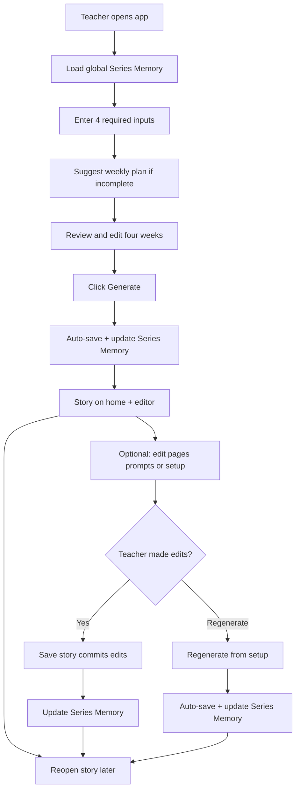
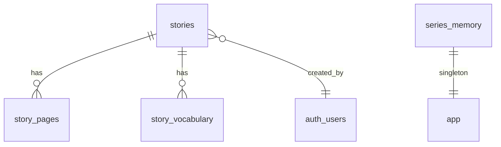
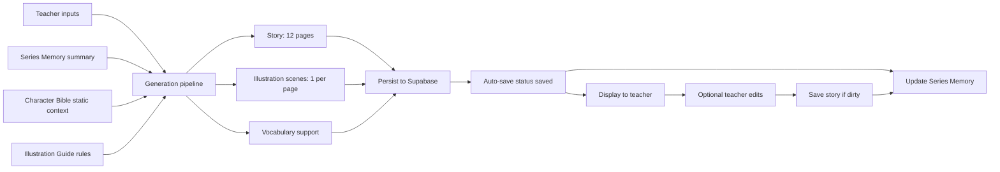

# Phase B: Architecture Map

Version: 1.0

Purpose:

This document maps the V1 product specifications into a simple, understandable architecture.

Planning only. No production code.

**Source of truth (authority order):**

1. [product-spec.md](before-coding/product-spec.md)
2. [source-of-truth.md](before-coding/source-of-truth.md)
3. [v1-scope.md](before-coding/v1-scope.md)
4. [character-bible.md](before-coding/character-bible.md)
5. [illustration-guide.md](before-coding/illustration-guide.md)
6. [drift-log.md](before-coding/drift-log.md)

**Architecture decisions incorporated (Phase B):**

* Supabase Auth — individual teacher accounts (no student accounts)
* Global shared Series Memory — all teachers contribute to the same Nina & Nino continuity
* Framework-agnostic frontend structure — specs do not mandate a tech stack

**Spec alignment:**

Generate and Regenerate auto-save (`status = saved`). Series Memory updates on successful auto-save and when the teacher commits later edits via Save story. Memory does not update on failed generation. Archive rebuilds memory from active saved stories so archived stories no longer influence generation.

---

# 1. Product Summary

StoryGen V2 is a teacher-first web application that helps kindergarten, preschool, ESL/EFL, and early literacy teachers create usable educational stories quickly.

V1 delivers:

* **Nina & Nino** stories for ages 4–6, English only
* **12 story pages** per story (~30–40 words per page)
* **Illustration scenes** (one short scene per page, stored in `illustration_prompt`) — full copy-ready production prompts assembled on copy for external image tools; no in-app image generation
* **Vocabulary support** / flashcards aligned to the teacher's vocabulary focus
* **Global Series Memory** persisted in Supabase — maintains continuity and reduces repetition across all saved stories
* **Supabase Auth** for individual teacher accounts
* **Private hosted URL** for validation with a small trusted teacher group — not a public launch

Primary goal: help teachers reach a usable first draft with minimal interaction time. Generation should feel fast; the under-2-minute figure is a soft guiding target, not a hard SLA.

V1 exists to validate the core workflow, not to scale or future-proof.

---

# 2. Core V1 Workflow

This workflow must work end-to-end. If any step fails, V1 fails.

1. Teacher opens the app (authenticated via Supabase Auth)
2. System loads global Nina & Nino Series Memory
3. Teacher enters minimal inputs (4 required, optional fields as needed)
4. Teacher clicks Generate
5. System auto-saves and teacher receives:
   * 12 story pages
   * 12 illustration scenes (one per page; full prompts on copy)
   * Vocabulary support / flashcards
   * Story on home / recent stories list
   * Series Memory updated
6. Teacher optionally edits page text, illustration scenes, or story setup inputs
7. If edited, teacher clicks **Save story** to commit changes (updates Series Memory)
8. Teacher may **Regenerate** from stored setup inputs (replaces content; auto-saves)
9. Teacher reopens the story later

**Important:** **Save story** is not part of first-generation workflow. It is enabled only after the teacher makes edits (dirty state).



---

# 3. Proposed App Routes

Keep routes minimal. Only what V1 requires.

| Route | Purpose |
|-------|---------|
| `/` | Public landing page; existing `LoginForm` entry (invite-only sign-in) |
| `/stories` | Authenticated story list (teacher's own saved stories) + "New Story" action |
| `/stories/new` | Input form + **Suggest weekly plan** + Generate (Generate enabled only when four weekly guidance fields are complete) |
| `/stories/[id]` | Story viewer/editor: 12 pages, illustration scenes (show/hide + copy for full prompt), vocabulary, Edit Story Setup, Regenerate, Save story (edits only) |

**Auth behavior:**

* Unauthenticated users visiting protected routes redirect to `/`
* Authenticated users visiting `/` redirect to `/stories`
* Post-login redirect to `/stories`; sign-out returns to `/`
* Legacy `/login` requests redirect to `/` (signed out) or `/stories` (signed in); no `/login` page
* Auth onboarding: invite-only — admin provisions teacher accounts; public sign-up disabled in Supabase
* No routes for settings, export, student mode, image preview, or marketplace features

**Story list behavior (locked):**

* `/stories` lists teacher's own `saved` stories only (`status = saved` and `is_archived = false`)
* `draft` status is not used after successful generate (schema may retain the value; generate/regenerate write `saved`)
* After generate, teacher is redirected to `/stories/[id]`; story is auto-saved and appears on home immediately
* Teachers can archive a saved story from the home list (X on story card); sets `is_archived = true`; story hidden from home; Series Memory is rebuilt from remaining active saved stories (archived story excluded from `recent_stories`, `themes_covered`, `vocabulary_history`, and `settings`)

---

# 4. Proposed Data Model

Supabase tables for V1. Five tables — no over-engineering.

Locked official character definitions (Nina, Nino, Mom, Dad, Grandpa, Ms. Lee) come from static [character-bible.md](before-coding/character-bible.md) at generation time. They are not duplicated in the database for V1; teachers cannot edit profiles in V1.

## `stories`

Story metadata and teacher inputs.

| Column | Type | Notes |
|--------|------|-------|
| `id` | uuid | Primary key |
| `created_by` | uuid | FK to `auth.users` |
| `status` | text | `draft` or `saved` |
| `title` | text | Short label (derived from theme or generated) |
| `theme` | text | Required input |
| `learning_goal` | text | Required input |
| `vocabulary_focus` | text | Derived aggregate of per-week vocabulary (legacy fallback for old stories) |
| `weekly_plan` | jsonb | Required structured plan: `{ week1–week4: { events, vocabulary } }` |
| `main_events` | text | Legacy sync text derived from `weekly_plan`; kept for series memory and legacy reads |
| `setting` | text | Optional, nullable |
| `tone` | text | Optional, nullable |
| `words_to_avoid` | text | Optional, nullable |
| `notes` | text | Optional, nullable |
| `created_at` | timestamptz | |
| `updated_at` | timestamptz | |
| `saved_at` | timestamptz | Nullable; set when status becomes `saved` |
| `is_archived` | boolean | Default `false`; `true` hides story from home list (soft delete) |

## `story_pages`

One row per page. Exactly 12 pages per story.

| Column | Type | Notes |
|--------|------|-------|
| `id` | uuid | Primary key |
| `story_id` | uuid | FK to `stories` |
| `page_number` | int | 1–12 |
| `text` | text | ~30–40 words |
| `illustration_prompt` | text | Short editable illustration scene (10–50 words) per [illustration-guide.md](before-coding/illustration-guide.md); full production prompt assembled on copy |

Unique constraint on `(story_id, page_number)`.

## `story_vocabulary`

Vocabulary support / flashcards per story.

| Column | Type | Notes |
|--------|------|-------|
| `id` | uuid | Primary key |
| `story_id` | uuid | FK to `stories` |
| `word` | text | Target vocabulary word |
| `definition_or_example` | text | Child-friendly definition or example sentence |
| `sort_order` | int | Display order |

## `series_memory`

Singleton table — one row for global Nina & Nino shared memory.

| Column | Type | Notes |
|--------|------|-------|
| `id` | text | Fixed constant (e.g. `nina-nino`) |
| `summary` | jsonb | Compressed continuity data (see below) |
| `updated_at` | timestamptz | Last save-triggered update |

**`summary` JSONB structure:**

```json
{
  "characters": [],
  "settings": [],
  "recent_stories": [],
  "vocabulary_history": [],
  "themes_covered": [],
  "repetition_notes": []
}
```

* `characters` — Tier 2/3 promotions, story-specific traits, appearance changes noted in saved stories
* `settings` — recurring locations used across stories
* `recent_stories` — compressed summaries (title, theme, key events, vocab taught, characters appeared); capped at 10–15 entries
* `vocabulary_history` — words taught across saved stories
* `themes_covered` — recent themes for repetition avoidance
* `repetition_notes` — brief patterns to vary in future generation

Compressed story summaries live inside `series_memory.summary.recent_stories`. No separate `story_memory_summaries` table for V1.

## Entity relationships



## Row Level Security (intent)

* Teachers read and write their own `stories`, `story_pages`, and `story_vocabulary`
* All authenticated teachers can read `series_memory`
* `series_memory` updates happen server-side on save only — not from the client directly

---

# 5. Series Memory Plan

## What memory stores

Per [source-of-truth.md](before-coding/source-of-truth.md), Series Memory tracks:

* Characters (Tier 2/3 promotions, appearance changes from saved stories)
* Character appearance rules and relationships observed in stories
* Compressed story history (not full page text)
* Themes and settings used
* Key events from saved stories
* Vocabulary history
* Repetition patterns

Locked official characters (Nina, Nino, Mom, Dad, Grandpa, Ms. Lee) are always injected from [character-bible.md](before-coding/character-bible.md) at generation time.

## When memory updates

| Event | Updates memory? |
|-------|-----------------|
| Generate succeeds (auto-save) | Yes |
| Regenerate succeeds (auto-save) | Yes |
| Teacher commits edits via Save story | Yes |
| Generation or regeneration fails | No |
| Story archived | Rebuild from active saved stories (removes archived influence; does not append) |
| Edit Story Setup only (no Regenerate) | No |
| Page/prompt edits not yet saved via Save story | No |

## What loads during generation

1. Global `series_memory.summary` (compressed JSON)
2. Static character bible excerpt (Tier 1 always; relevant Tier 2 from memory)
3. Illustration guide rules (style suffix, prompt format)
4. Teacher inputs (required + optional) — **these override continuity**

Priority order per spec:

1. Core continuity entities
2. Recent story history
3. Relevant story history
4. Compressed older history

## How to avoid loading every full story

* Never load all `story_pages` text for all stories into the generation prompt
* Use `recent_stories` summaries only: title, theme, 2–3 sentence plot, vocabulary used, characters that appeared
* Cap `recent_stories` at 10–15 entries; roll off or further compress oldest entries
* Tier 1 character definitions are static — no DB fetch needed

## Teacher instructions override continuity

Teacher inputs take precedence over memory hints:

* `theme`, `learning_goal`, `vocabulary_focus`, `weekly_plan` define the current story
* `notes`, `words_to_avoid`, `setting`, `tone` can explicitly override continuity suggestions

Continuity guides generation. Continuity does not block generation.

## On save — memory rebuild (server-side)

When a story is auto-saved (generate/regenerate) or manually saved (teacher commits edits), Series Memory is **rebuilt from all active saved, non-archived stories** — not incrementally appended. This keeps `recent_stories`, `themes_covered`, `vocabulary_history`, and `settings` aligned with visible stories only.

Per story, the rebuild includes:

1. Short summary (plot, theme, vocab, characters, setting)
2. `recent_stories` entry (cap 15)
3. `vocabulary_history` words from that story
4. `themes_covered` theme
5. `settings` when the story has a setting

Archive uses the same rebuild path (see When memory updates above).

---

# 6. Generation Pipeline



## Inputs

**Required** (from [v1-scope.md](before-coding/v1-scope.md)):

* Monthly Topic (Theme)
* Learning Goal
* Week 1–4 guidance (optional): Main Events + Vocabulary per week — brief hints, not scripts

**Optional:**

* Setting
* Tone
* Words to avoid
* Notes

## Context assembled for generation

| Source | What it provides |
|--------|------------------|
| Teacher inputs | Story direction; overrides continuity |
| Series Memory | Compressed history, vocab taught, themes, characters, repetition notes |
| Character Bible | Tier 1 characters, voice rules, age guardrails, educational tone |
| Illustration Guide | Scene format, copy-time assembly rules, locked continuity suffix (16:9 framing), character consistency rules |
| Character profiles | Official character descriptors for copy-assembled production prompts |

## Outputs

| Output | Spec |
|--------|------|
| Story pages | 12 pages, ~30–40 words each, ages 4–6 readability |
| Illustration scenes | 1 per page; short scene stored (10–50 words); full copy-ready production prompt assembled on copy from profiles + scene + style suffix |
| Vocabulary support | Words from per-week vocabulary (preferred) or derived aggregate; child-friendly definitions or examples |

## Save behavior

* Generate and Regenerate auto-save: `status = saved`, `saved_at` set, Series Memory merged
* Teacher can edit story setup (inputs only) via **Edit Story Setup**; pages unchanged until Regenerate
* Teacher can edit page text or illustration scenes; changes persist on blur
* Manual **Save story** commits saved state + Series Memory when the teacher has unsaved edits (dirty state)

## Regenerate behavior

* Teacher may edit setup inputs first, then clicks Regenerate
* Pipeline re-runs with stored inputs + current Series Memory
* Replaces pages, prompts, and vocabulary; auto-saves (no draft demotion)

## Draft behavior

* `draft` applies only before first successful generation (in-progress create flow)
* Successful generate and regenerate write `saved` immediately
* Story title auto-generated from theme (truncated short label); Edit Story Setup may update title from theme before Regenerate
* Illustration scenes: show/hide in UI; copy assembles full production prompt; per-page regenerate for new scene after page text edit
* Vocabulary items: read-only; regenerate to change

## Error behavior (locked)

| Failure | Behavior |
|---------|----------|
| AI output validation fails | One repair pass for short pages when repairable; one repair pass for week adherence drift when a complete weekly plan is present; if still invalid, return error (422); no mock/template save; no Series Memory update |
| API / key / timeout unavailable | Mock template fallback allowed; auto-save if persist succeeds; warning shown |
| Series Memory load fails | Proceed with empty memory + static character bible; show non-blocking warning |
| Save fails (edit commit) | Show error; remain on editor; page edits preserved in DB; memory not updated until Save succeeds |

## V1 shortcut

Per [v1-scope.md](before-coding/v1-scope.md), mock/fixture generation is acceptable when the OpenAI API is unavailable (missing key, timeout, HTTP error). Mock fallback does **not** apply to AI output validation failure.

## Topic-centered weekly planning (Phase 1)

Teachers plan stories with **Monthly Topic + Week 1–4** fields (not a single Main Events textarea).

| Page block | Weekly milestone |
|------------|------------------|
| 1–3 | Week 1 |
| 4–6 | Week 2 |
| 7–9 | Week 3 |
| 10–12 | Week 4 |

* Topic = master monthly umbrella; weeks are parts of one continuous Topic-centered story
* Stored in `stories.weekly_plan` (jsonb); `main_events` kept as derived sync text for legacy reads and series memory
* **Pre-generation:** `POST /api/stories/suggest-weekly-plan` proposes main-idea beats for empty weeks; teacher reviews on create form
* **Generate gate:** complete four-week plan required (`isCompleteWeeklyPlan`)
* Generation prompts use approved weekly milestones when plan is complete
* Post-generation: merge `inferred_weekly_plan` if present; validation is structural + week-language leak only

---

# 7. Frontend Structure

Simple, framework-agnostic folder structure. No unnecessary architecture.

```
app/                          # or pages/ — route files
  page.tsx                    # public landing + sign-in
  stories/
    page.tsx                  # story list (authenticated home)
    new/page.tsx              # create + generate
    [id]/page.tsx             # view / edit / save / regenerate

components/
  auth/                       # LoginForm, AuthGuard
  stories/                    # StoryList, StoryCard
  create/                     # StoryInputForm (4 required + optional)
  story/                      # StoryPageView, PageEditor, PromptCopyButton, VocabularyList
  ui/                         # LoadingState, ErrorMessage, Button

lib/
  supabase/
    client.ts                 # browser client
    server.ts                 # server client for save and memory updates
  db/                         # queries: stories, pages, vocabulary, series_memory
  generation/
    pipeline.ts               # orchestrates story + prompts + vocab
    prompts.ts                # builds LLM prompts from inputs + memory + bible
  series-memory/
    load.ts                   # fetch and format for generation
    update.ts                 # merge on save
  constants/
    character-bible.ts        # static excerpt from character-bible.md
    illustration-style.ts     # style suffix from illustration-guide.md
```

**State management:** No global state library required for V1. Route-level data fetching plus local edit state on the story page is sufficient.

---

# 8. Implementation Order

Each step is independently understandable and validates one part of the core workflow.

| Step | What to build | Validates |
|------|---------------|-----------|
| 1 | Supabase project setup — tables, RLS policies, auth enabled | Persistence foundation |
| 2 | Auth shell — landing sign-in at `/`, session guard, sign-out | Teacher access |
| 3 | Story list route — fetch teacher's saved stories | Reopen stories |
| 4 | Create route + input form — 4 required + optional fields | Minimal inputs |
| 5 | Generation pipeline (mock) — fixture 12-page story with prompts + vocab | Generate flow |
| 6 | Story display route — pages, prompts with copy button, vocabulary | Output display |
| 7 | Auto-save on generate/regenerate + Save story for edit commits | Save stories |
| 8 | Series Memory load — read singleton on app open / before generate | Memory load |
| 9 | Series Memory update — server-side merge on auto-save and edit Save | Memory update |
| 10 | Real LLM generation — replace mock pipeline | Real story quality |
| 11 | Edit + regenerate — inline page text edit, re-run pipeline from inputs | Edit scope |
| 12 | Loading and error states — generation, save, reopen failures | Error handling |
| 13 | Private URL deploy — hosted deployment for teacher validation group | Private URL V1 |

Build in order. Do not skip save and memory steps before adding real generation.

---

# 9. Explicit Non-Goals

Do not build these in V1. Sourced from [v1-scope.md](before-coding/v1-scope.md) and locked decisions.

* Student accounts / student mode
* Parent / non-teacher user flows
* In-app image generation or image storage
* Export systems (PDF, print, download packs)
* Public launch / marketing site
* Marketplace, social, collaboration, or sharing systems
* Multiple series support
* Curriculum mapping
* Complex editing (page reorder, rich text editor, image editing)
* Advanced customization
* Activities, worksheets, audio, roleplay
* Analytics, payments, enterprise infrastructure
* Mobile-first optimization
* localStorage as primary persistence
* Loading full text of every previous story into generation calls
* Unarchive / trash view for archived stories

---

# 10. Open Questions / Risks

Genuine blockers or risks only. No invented complexity.

| Risk / Question | Why it matters | Status |
|-----------------|----------------|--------|
| **LLM provider and cost** | Not specified in specs. Affects generation quality, latency, and pipeline design. | Open — decide before step 10. Does not block mock-first build. |
| **Shared memory across teachers** | Global memory means Teacher A's saved story affects Teacher B's next generation. | Accepted — intentional for V1 validation. Monitor during teacher testing. |
| **Generation latency** | Soft target, not SLA. Long LLM calls need clear loading UX. | Accepted — loading states in step 12. |

**Resolved in Phase C (see [drift-log.md](before-coding/drift-log.md)):** invite-only auth, saved-only story list, error behavior defaults, no story deletion in V1.

**Resolved 2026-06-08 (see [drift-log.md](before-coding/drift-log.md)):** generate/regenerate auto-save; Save story for edit commits only; Edit Story Setup without auto-regenerate.

No unresolved spec conflicts.

---

# Appendix: Required Inputs and Outputs Quick Reference

**Inputs:**

| Field | Required |
|-------|----------|
| Theme / Topic | Yes |
| Learning Goal | Yes |
| Week 1 guidance (Pages 1–3) | No |
| Week 2 guidance (Pages 4–6) | No |
| Week 3 guidance (Pages 7–9) | No |
| Week 4 guidance (Pages 10–12) | No |
| Setting | No |
| Tone | No |
| Words to avoid | No |
| Notes | No |

**Outputs per story:**

| Output | Count |
|--------|-------|
| Story pages | 12 |
| Illustration prompts | 12 (one per page) |
| Vocabulary items | Variable (aligned to vocabulary focus) |

---

# 11. Post-V1 Approved Future: Editable Characters Phase 1

**Status:** Approved for future implementation — **not yet built**. Sections 1–10 above describe the frozen V1 architecture and remain unchanged until Phase 1 ships.

**Direction:** [docs/character-editing-decision-record.md](character-editing-decision-record.md)

## Future table: `character_profiles`

| Purpose | Notes |
|---------|--------|
| Store editable **global default** profiles | Official characters only: Nina, Nino, Mom, Dad, Grandpa, Ms. Lee |
| Seed from Character Bible | Factory defaults from [character-bible.md](before-coding/character-bible.md) |
| Reset-to-default | Restore one character, all characters, or full factory set from bible |

Suggested columns (implementation detail — not finalized): character id/key, appearance text, personality text, updated_at. Exact schema to be defined at implementation time.

## Character profiles in generation (implemented)

1. Load `character_profiles` before story generation and on story detail page (alongside Series Memory and teacher inputs)
2. Use saved profiles for official character descriptors when present
3. Fall back to Character Bible / factory defaults when no saved row exists
4. OpenAI returns short `illustration_scene` per page; stored in `illustration_prompt`
5. Copy-assembled production prompts use the same profile source + locked illustration continuity suffix

## Future UI (minimal)

* **Edit Characters** button — single entry point on authenticated teacher surfaces (exact placement TBD; no new route required unless explicitly approved later)
* **Edit Characters** modal — edit appearance and personality; save and reset actions

## Explicitly not in Phase 1

* Series-scoped profiles
* Story-level character overrides stored on stories
* Teacher-created / story-introduced character persistence
* Character presets, multiple series, in-app image generation
* Additional routes beyond existing four unless separately approved
