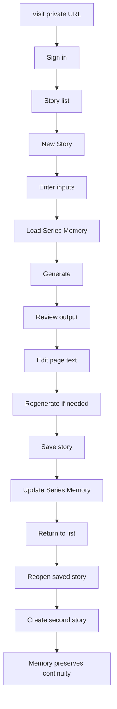

# Phase C: Validation Before Coding

Version: 1.0

Purpose:

Validate that the V1 product can be built without ambiguity, unnecessary complexity, or document conflict.

Validation only. No production code. No app implementation.

**Documents reviewed:**

1. [product-spec.md](../product-spec.md)
2. [source-of-truth.md](../source-of-truth.md)
3. [v1-scope.md](../v1-scope.md)
4. [character-bible.md](../character-bible.md)
5. [illustration-guide.md](../illustration-guide.md)
6. [drift-log.md](../drift-log.md)
7. [docs/phase-b-architecture-map.md](phase-b-architecture-map.md)
8. [.cursor/rules/project-authority.mdc](../.cursor/rules/project-authority.mdc)
9. [.cursor/rules/anti-overengineering.mdc](../.cursor/rules/anti-overengineering.mdc)
10. [.cursor/rules/documentation-discipline.mdc](../.cursor/rules/documentation-discipline.mdc)
11. [.cursor/rules/domain-boundaries.mdc](../.cursor/rules/domain-boundaries.mdc)
12. [.cursor/rules/file-creation.mdc](../.cursor/rules/file-creation.mdc)
13. [.cursor/rules/architecture-freeze.mdc](../.cursor/rules/architecture-freeze.mdc)

---

# 1. Executive Summary

| Question | Answer |
|----------|--------|
| Are the specs ready for coding? | **Yes** for mock-first build (architecture map steps 1–9). Minor doc gaps remain before real LLM integration and private deploy. |
| Is the core workflow clear? | **Yes** — the 18-step teacher journey maps to 4 routes and 5 Supabase tables without redesign. |
| Are there any blocking ambiguities? | **No** for starting implementation with mocks. Auth onboarding and LLM provider are undecided but do not block steps 1–9. |
| Are there any unnecessary complexities? | **No** — architecture is appropriately minimal for V1 validation. |
| Do the docs mostly agree? | **Yes** — one minor wording conflict on memory-update timing; otherwise aligned. |

**Overall status: Mostly Ready**

---

# 2. Complete Teacher Journey Walkthrough

| Step | Expected behavior | Required data | Possible failure | Docs clear? |
|------|-------------------|---------------|------------------|-------------|
| 1. Teacher visits private hosted URL | App loads; unauthenticated user redirected to `/login` | Hosted deployment URL | App unreachable; SSL/hosting misconfiguration | **Yes** |
| 2. Teacher signs in | Supabase Auth session created; redirect to `/` | Email + password (teacher account) | Invalid credentials; auth service down | **Mostly** — auth method clear; invite vs open sign-up undecided |
| 3. Teacher sees story list | List shows teacher's own **saved** stories + "New Story" action | `stories` where `created_by` = user and `status` = `saved` | Empty list (acceptable for new user); query failure | **Mostly** — draft visibility in list not explicitly stated |
| 4. Teacher clicks New Story | Navigate to `/stories/new`; empty input form shown | None | Route error | **Yes** |
| 5. Teacher enters required inputs | Form accepts Theme, Learning Goal, Vocabulary Focus, Main Events; validation blocks Generate if missing | 4 required text fields | Client validation failure messaging | **Yes** |
| 6. Teacher optionally enters optional inputs | Setting, Tone, Words to avoid, Notes accepted; all optional | 4 optional nullable fields | None significant | **Yes** |
| 7. System loads Nina & Nino Series Memory | Fetch global `series_memory` singleton before generation; inject into pipeline context | `series_memory.summary` JSONB | DB unreachable; empty memory on first use (acceptable) | **Mostly** — product-spec says load on app open; architecture says load before generate; same data, minor timing wording gap |
| 8. Teacher clicks Generate | Loading state shown; generation pipeline runs with inputs + memory + character bible + illustration guide | All inputs + memory summary + static bible/guide constants | LLM timeout; pipeline error; slow response | **Yes** |
| 9. System generates 12 pages, 12 prompts, vocabulary | Story persisted as `draft` with 12 `story_pages`, 12 `illustration_prompt` values, `story_vocabulary` rows; redirect to `/stories/[id]` | Generated content written to Supabase | Partial generation; invalid page count; missing prompts | **Yes** |
| 10. Teacher reviews output | Story page shows 12 pages, prompts with copy buttons, vocabulary list | `story_pages`, `story_vocabulary` for story id | Render error; truncated prompts | **Yes** |
| 11. Teacher edits text on one page | Inline edit of page `text` field; changes held locally or auto-persisted to draft | Updated page text | Lost edits on refresh if not persisted | **Mostly** — page text edit locked; auto-save timing not specified |
| 12. Teacher regenerates from edited inputs if needed | Regenerate re-runs pipeline with current inputs; replaces all pages, prompts, vocabulary; memory unchanged | Current inputs + memory; story remains `draft` | Regeneration failure; teacher loses unsaved page edits if not persisted before regen | **Yes** |
| 13. Teacher saves story | `status` → `saved`; `saved_at` set; pages and vocabulary persisted | Full story record | Save transaction failure | **Yes** |
| 14. Saved story updates Series Memory | Server-side merge into global `series_memory.summary`; not client-triggered | Saved story content + summary extraction | Memory merge failure; partial update | **Yes** |
| 15. Teacher returns to story list | Navigate to `/`; saved story appears in list | `stories` with `status` = `saved` | List not refreshed | **Yes** |
| 16. Teacher reopens saved story | Click story card → `/stories/[id]`; exact saved content displayed | `stories`, `story_pages`, `story_vocabulary` | Story not found; permission error | **Yes** |
| 17. Teacher creates a second story | Repeat create flow; memory now includes first story summary | Updated `series_memory.summary` | Same as step 8–9 failures | **Yes** |
| 18. System uses Series Memory for continuity | Second generation references compressed history; avoids exact repetition; teacher inputs still override | `recent_stories`, `vocabulary_history`, `themes_covered` in memory | Weak continuity (quality issue, not workflow failure) | **Yes** |

---

# 3. Ambiguity Check

Only real ambiguities that could affect implementation.

| Ambiguity | Why it matters | Current best default | Blocks coding? | Document to update |
|-----------|----------------|----------------------|----------------|-------------------|
| **Sign-up vs invite-only** | Determines Supabase Auth config and onboarding UX | Invite-only: admin creates teacher accounts; disable public sign-up in Supabase dashboard | No — mock-first can use test accounts | `phase-b-architecture-map.md`, `drift-log.md` |
| **Drafts in story list** | Affects home page query and UX expectations | List shows `saved` stories only; drafts reached via redirect after generate | No | `phase-b-architecture-map.md` |
| **Draft survives refresh** | Affects whether generate writes to DB immediately | Persist `draft` to Supabase on generate so refresh does not lose work | No | `phase-b-architecture-map.md` (confirm as locked decision) |
| **Failed generation behavior** | Affects error UX and DB state | Show error message + retry; do not update Series Memory; do not create orphan story row (or keep prior draft unchanged) | No | `phase-b-architecture-map.md` or `v1-scope.md` |
| **Regenerate scope** | Affects what gets replaced | Full replace of all 12 pages, prompts, and vocabulary | No — already in phase-b | None |
| **Story deletion in V1** | Affects whether delete UI and cascade logic are built | Exclude from V1 — no delete button | No | `v1-scope.md` explicit exclusions |
| **Delete affects Series Memory** | Only relevant if delete exists | Per source-of-truth: memory does **not** update on delete | N/A if no delete | None |
| **Edit illustration prompts** | Affects editor UI scope | Read-only display + copy button; regenerate for new prompts | No | `illustration-guide.md` already notes editing is optional |
| **Edit vocabulary items** | Affects editor UI scope | Read-only in V1; regenerate to change vocabulary | No | `phase-b-architecture-map.md` edit scope section |
| **Story title source** | Affects `stories.title` population | Auto-generated from theme (truncate to short label) | No | `phase-b-architecture-map.md` |
| **Vocabulary count range** | Affects generation prompt and validation | 5–7 target words per story unless Notes request more (per character-bible) | No | `character-bible.md` (already stated) |
| **Series Memory load failure** | Affects generate behavior when DB fails | Proceed with empty memory + static character bible; show non-blocking warning | No | `phase-b-architecture-map.md` |
| **Global shared memory across teachers** | Teacher A's save affects Teacher B's generation | Intentional for V1 validation; all teachers share one `series_memory` row | No | `phase-b-architecture-map.md` |
| **Save failure** | Affects error UX | Show error; remain on editor; draft data preserved; memory not updated | No | `phase-b-architecture-map.md` |
| **Memory load timing** | App open vs pre-generate | Load before generate (sufficient); optional prefetch on app open is acceptable | No | None — cosmetic wording only |

---

# 4. Complexity Review

Test: *Does this help validate the core teacher workflow?*

| Item | Verdict | Rationale |
|------|---------|-----------|
| Supabase Auth | **Keep** | Required for private URL, per-teacher story ownership, and session persistence |
| Supabase persistence | **Keep** | Locked in source-of-truth; core workflow requires save/reopen across sessions |
| Global shared Series Memory | **Keep** | Validates continuity and repetition reduction across the teacher validation group |
| Draft persistence to Supabase | **Keep** | Prevents lost work on refresh; supports reopen of in-progress drafts via URL |
| Edit + regenerate | **Keep** | Locked V1 edit scope; required for workflow validation |
| Illustration prompts (no images) | **Keep** | Core V1 output; simpler than in-app image generation |
| Vocabulary support / flashcards | **Keep** | Core V1 output; required for usable story definition |
| Story list on `/` | **Keep** | Required for reopen saved stories |
| 4 routes (`/login`, `/`, `/stories/new`, `/stories/[id]`) | **Keep** | Minimal set per architecture freeze; maps 1:1 to workflow |
| 5 Supabase tables | **Keep** | No over-engineering; no 6th table needed |
| JSONB Series Memory summary | **Keep** | Simpler than normalized memory tables for V1 |
| Cursor rules (6 files) | **Keep** | Lightweight guardrails; no runtime cost; prevent drift during build |
| Mock-first generation | **Keep** | Explicitly allowed in v1-scope; reduces early complexity |
| Server-side memory merge on save | **Keep** | Prevents client tampering; matches locked update rule |

**Nothing recommended for Simplify, Remove from V1, or Defer** — the current architecture is already minimal for workflow validation.

---

# 5. Missing Decisions

Decisions needed for implementation. Recommended defaults favor fewer moving parts.

| Decision needed | Recommended simple default | Reason | Document to update |
|-----------------|---------------------------|--------|-------------------|
| Initial auth method | Supabase email + password | Standard Supabase Auth; no OAuth complexity for V1 | `phase-b-architecture-map.md` |
| Sign-up open or invite-only | Invite-only; admin provisions accounts | Matches private URL + small trusted group | `drift-log.md` |
| Drafts auto-save on generate | Yes — write `draft` to Supabase immediately on successful generate | Refresh-safe; memory still updates only on save | `phase-b-architecture-map.md`, `drift-log.md` |
| Generated drafts in story list | No — list shows `saved` only | Keeps home page simple; draft accessed via post-generate redirect | `phase-b-architecture-map.md` |
| Unsaved generated stories survive refresh | Yes — because draft is in Supabase | Consistent with draft persistence default | `phase-b-architecture-map.md` |
| Saved stories deletable in V1 | No — exclude delete UI | Reduces scope; source-of-truth already defines no memory update on delete | `v1-scope.md` exclusions |
| Deleting saved story affects memory | N/A — no delete in V1 | source-of-truth: memory does not update on delete | None |
| Teachers edit illustration prompts | No — read-only + copy; regenerate for changes | Locked edit scope is text + regenerate; illustration-guide says prompt editing is optional | None |
| Teachers edit vocabulary items | No — read-only; regenerate for changes | Consistent with minimal edit scope | `phase-b-architecture-map.md` |
| Story title source | Auto from theme (truncated, e.g. first 60 chars) | No extra input field; faster workflow | `phase-b-architecture-map.md` |
| Vocabulary count default | 5–7 words per story | character-bible section 11; matches ages 4–6 | None — already in character-bible |
| Generation failure behavior | Error message + retry button; no memory update; no partial story saved | Protects core workflow; v1-scope requires error handling | `phase-b-architecture-map.md` |
| Series Memory load failure | Proceed with empty memory; non-blocking warning to teacher | Continuity should guide, not block, generation | `phase-b-architecture-map.md` |
| Save failure behavior | Error message; stay on editor; draft preserved; memory not updated | v1-scope: broken save is not acceptable | `phase-b-architecture-map.md` |
| LLM provider | Undecided — use mock/fixture until step 10 | v1-scope allows mocks; does not block steps 1–9 | Decide before architecture map step 10 |

---

# 6. Cross-Document Consistency Check

| Documents | Issue | Severity | Recommended fix |
|-----------|-------|----------|-----------------|
| `product-spec.md` vs `source-of-truth.md` | product-spec line 113 says "Generated story updates Series Memory"; source-of-truth locks update to **save only** | **Minor** | Update product-spec line 113 to "Saved story updates Series Memory" |
| `source-of-truth.md` vs `v1-scope.md` | Aligned on workflow, inputs, outputs, persistence, illustrations, edit scope | **None** | No fix needed |
| `v1-scope.md` vs `phase-b-architecture-map.md` | Aligned on routes, tables, memory behavior, exclusions | **None** | No fix needed |
| `character-bible.md` vs `illustration-guide.md` | Aligned — illustration prompts use bible section 12 descriptors; vocabulary and settings consistent | **None** | No fix needed |
| `drift-log.md` vs current decisions | drift-log says "no open decisions" but phase-b lists undecided auth onboarding and draft visibility | **Minor** | Add Accepted drift-log entries for phase-c recommended defaults |
| `phase-b-architecture-map.md` vs `source-of-truth.md` | phase-b correctly applies save-only memory rule and documents the product-spec conflict resolution | **None** | No fix needed |
| Cursor rules vs source docs | Rules reflect authority order, frozen architecture, anti-overengineering, and doc-first discipline | **None** | No fix needed |
| `product-spec.md` vs `phase-b-architecture-map.md` | product-spec implies memory load on app open; phase-b loads before generate | **Cosmetic** | Optional: align wording in product-spec workflow section |

**No blocking conflicts found.**

Higher authority wins where conflicts exist: `source-of-truth.md` save-only memory rule overrides `product-spec.md` general wording.

---

# 7. Validation Scenarios

Five manual scenarios. Each tests one important product truth.

## Scenario 1: First story generation

**Tests:** Minimal inputs produce a complete usable first draft.

| | |
|-|-|
| **Setup** | New teacher account; empty `series_memory`; no prior stories |
| **Steps** | Sign in → New Story → enter 4 required inputs → Generate → review output |
| **Expected result** | 12 pages (~30–40 words each), 12 illustration prompts with copy buttons, vocabulary items aligned to vocabulary focus; story saved as `draft`; memory unchanged |
| **Failure would mean** | Core generation workflow is broken; V1 fails |

## Scenario 2: Second story continuity

**Tests:** Series Memory preserves Nina & Nino continuity across stories.

| | |
|-|-|
| **Setup** | One saved story in memory; teacher creates a second story |
| **Steps** | New Story → different theme but same series → Generate → compare characters and tone to first story |
| **Expected result** | Nina and Nino appear with consistent traits; subtle callback or shared setting possible; story feels connected to the series |
| **Failure would mean** | Series Memory load or merge is not working; continuity validation fails |

## Scenario 3: Repetition avoidance

**Tests:** Memory reduces accidental duplication when themes overlap.

| | |
|-|-|
| **Setup** | Saved story with theme "park" and duck-feeding plot; memory contains that theme and summary |
| **Steps** | New Story → similar park theme → Generate → compare plot structure to first story |
| **Expected result** | Second story varies plot beats or vocabulary presentation; does not duplicate the first story's main events |
| **Failure would mean** | `themes_covered` and `recent_stories` are not influencing generation |

## Scenario 4: Teacher override

**Tests:** Teacher instructions override continuity rules.

| | |
|-|-|
| **Setup** | Memory suggests recurring park setting; teacher enters Notes: "Story takes place at home today" and Main Events describing indoor activities |
| **Steps** | Enter overriding inputs → Generate |
| **Expected result** | Story set at home per teacher inputs; memory hints do not force park setting |
| **Failure would mean** | Continuity is blocking or overriding teacher inputs — violates source-of-truth |

## Scenario 5: Save and reopen

**Tests:** Save persists story; memory updates on save only; reopen retrieves exact content.

| | |
|-|-|
| **Setup** | Generated draft story on `/stories/[id]` |
| **Steps** | Edit page 3 text → Save → return to list → reopen story → verify page 3 text and memory `updated_at` |
| **Expected result** | Saved story appears in list; reopened content matches saved state including edited page 3; `series_memory` updated after save, not before |
| **Failure would mean** | Save, reopen, or save-only memory update is broken — V1 fails |

---

# 8. Final Recommendation

## Recommendation: Proceed after minor doc edits

The specs are sufficient to begin mock-first implementation (architecture map steps 1–9). The core workflow is clear, architecture is appropriately simple, and there are no blocking document conflicts.

Coding can start now if implementers apply the recommended defaults in Section 5 where docs are silent. Locking those defaults into docs first is preferable but not blocking for mock-first work.

## Top 3 things to fix before coding

1. **Fix product-spec.md line 113** — change "Generated story updates Series Memory" to "Saved story updates Series Memory" to match source-of-truth.
2. **Lock phase-c defaults into drift-log.md** — invite-only auth, saved-only story list, draft persistence on generate.
3. **Add error-behavior notes to phase-b-architecture-map.md** — generation failure, memory load failure, save failure (Section 5 defaults).

## Top 3 things NOT to worry about yet

1. **LLM provider choice** — mock/fixture generation is acceptable per v1-scope until step 10.
2. **Manual editing of illustration prompts or vocabulary** — regenerate is sufficient for V1.
3. **Story deletion, export, in-app images, student accounts** — all explicitly excluded from V1.

---

# Appendix: Readiness Scorecard

| Metric | Value |
|--------|-------|
| Overall readiness status | **Mostly Ready** |
| Blocking issues | **0** (for mock-first coding) |
| Minor doc edits recommended | **4** |
| Cosmetic doc edits | **1** |
| Coding can start after this phase | **Yes** — mock-first path is clear; optional doc edits improve clarity |

### Minor doc edits (recommended)

1. `product-spec.md` — memory update wording (line 113)
2. `drift-log.md` — add Accepted entries for phase-c defaults
3. `phase-b-architecture-map.md` — confirm draft/list/error behavior defaults
4. `v1-scope.md` — add explicit "no story delete in V1" to exclusions (optional clarity)

### Non-blocking until later steps

| Item | Needed before |
|------|---------------|
| LLM provider selection | Architecture map step 10 |
| Auth invite flow UX polish | Private URL deploy (step 13) |
| Continuity quality tuning | Teacher validation testing |

---

*End of Phase C validation. No production code. No app files created.*
